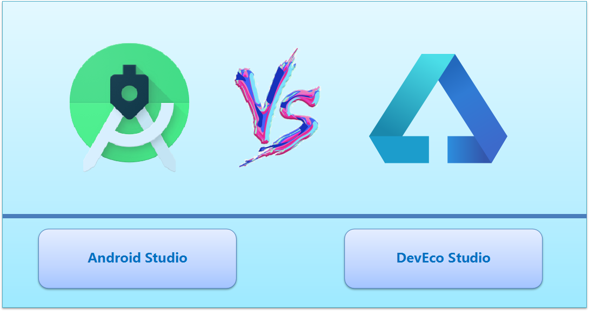
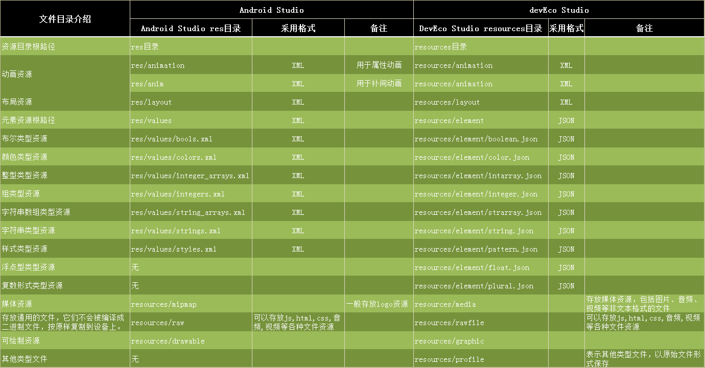
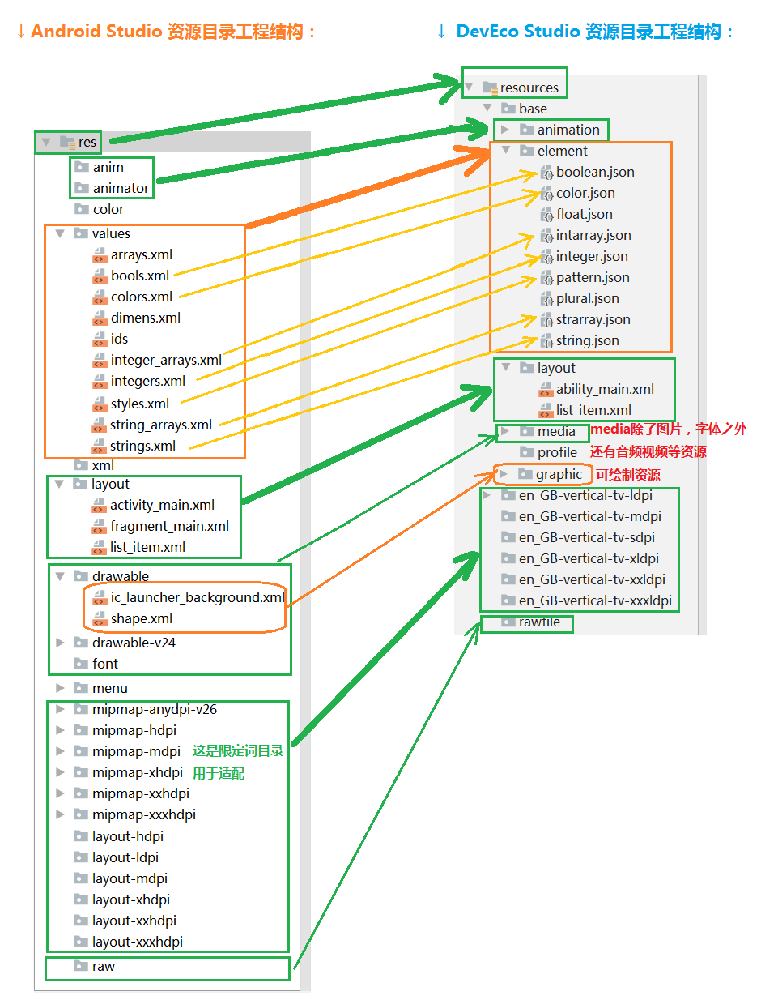
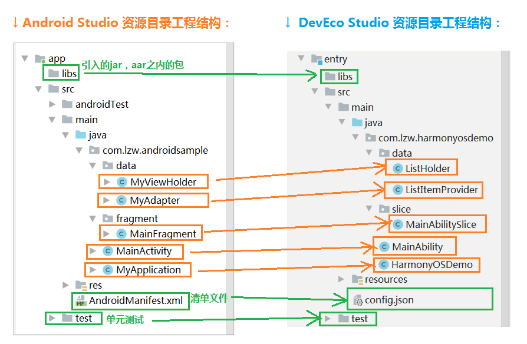
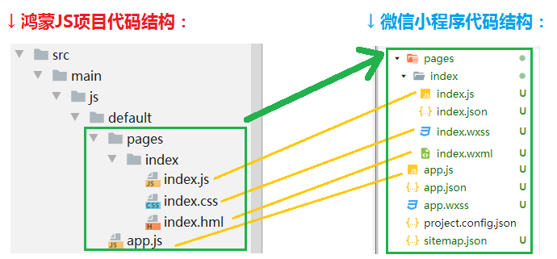

#  AndroidVSHarmony

[TOC]

## 介绍

* The project tells you how to develop the HarmonyOS project.And it shows the differences between [Android] project and [HarmonyOS] project.And it shows the differences between [WeChat-mini-program] project and [HarmonyOS] project.

* HarmonyOS初入门体验，以及鸿蒙项目和Andrid项目，以及鸿蒙项目和微信小程序对比。

**在9月10日召开的华为开发者大会上，宣布了鸿蒙2.0系统正式面世，同时开启了Beta版本的测试和开源网站。对于开发者来说两个最关键的点值得关注：一个是Beta版的开发工具，一个是开源网站。**

----

## 一、开源网站

在开发者大会上宣布将HarmonyOS源代码捐赠给中国开放原子开源基金会，并在大会上公布了鸿蒙系统的开源路线。

官网地址：

[OpenHarmony 官方源码地址](https://openharmony.gitee.com/openharmony)

------

## 二、开发工具

鸿蒙使用基于Intellij IDEA深度定制研发的DevEco Studio作为其开发工具。官方下载地址如下：

[DevEco Studio 下载地址](https://developer.harmonyos.com/cn/develop/deveco-studio)

------

## 三、鸿蒙应用初体验视频讲解

**全网最新最全面的DevEco Studio开发鸿蒙HarmomyOS项目初体验。我这里从五个方面给大家详细讲解鸿蒙应用开发，包括：开发工具安装和配置；项目代码分析；项目部署运行到模拟器；鸿蒙项目和Android项目对比；鸿蒙项目和微信小程序项目对比，最后一部分是结束语。**

* 开发工具安装和配置。
* 项目代码分析)。
* 项目部署运行到模拟器。
* 鸿蒙项目和Android项目对比。
* 鸿蒙项目和微信小程序项目对比。
* 最后一部分是结束语总结。

:movie_camera: **[带你一起走进DevEco Studio开发鸿蒙应用初体验系列视频，点此进行观看](https://www.bilibili.com/video/BV1vv411C7Sq/)**

----

## 四、视频配套项目源码地址

↓ **视频配套项目源码地址：**

[https://github.com/AweiLoveAndroid/AndroidVSHarmonygithub.com](https://github.com/AweiLoveAndroid/AndroidVSHarmonygithub.com)

----

##  五、HarmonyOS项目和Android项目对比

### （一）资源目录的变更

#### 1.资源目录名称有更改

安卓res目录，这里用resources目录, 它包括base 和 rawfile两部分，其中base是核心的资源目录，常用的都放在这里面，便于查找和使用。rawfile会原封不动打包到生成的应用里面。

安卓是res/values目录，这里是resources/element目录。

安卓raw目录，这里用rawfile目录。

#### 2.资源目录分门别类，统一管理

android目录结构就比较松散，没有统一的文件夹管理，res/values目录里面可以创建各种资源的xml文件，只能去官网查看有哪些可以创建。

这里有base目录统一管理。

#### 3.部分资目录删除，新增一些资源目录类型

比如float.json文件, plural.json文件, profile文件夹等。

#### 4.编写方式有改变,xml变更为json

安卓的values里面是xml写的，这里是element目录里面的，都是json格式的。

**最后了一张同类型资源对比图：**

| 文件目录介绍                                                 | Android Studio res目录        | 采用格式                                    | 备注             | DevEco Studioresources目录      | 采用格式 | 备注 |
| ------------------------------------------------------------ | ----------------------------- | ------------------------------------------- | ---------------- | ------------------------------- | -------- | ---------------------------------------------------- |
| **资源目录根路径**                                           | res目录                       |                                             |                  | resources目录                   |          |                                                      |
| **动画资源**                                                 | res/animation                 | XML                                         | 用于属性动画     | resources/animation             | XML      |                                                      |
| **动画资源**                                                 | res/anim                      | XML                                         | 用于补间动画     | resources/animation             | XML      |                                                      |
| **布局资源**                                                 | res/layout                    | XML                                         |                  | resources/layout                | XML      |                                                      |
| **元素资源根路径**                                           | res/values                    | XML                                         |                  | resources/element               | JSON     |                                                      |
| 布尔类型资源                                                 | res/values/bools.xml          | XML                                         |                  | resources/element/boolean.json  | JSON     |                                                      |
| 颜色类型资源                                                 | res/values/colors.xml         | XML                                         |                  | resources/element/color.json    | JSON     |                                                      |
| 整型类型资源                                                 | res/values/integer_arrays.xml | XML                                         |                  | resources/element/intarray.json | JSON     |                                                      |
| 组类型资源                                                   | res/values/integers.xml       | XML                                         |                  | resources/element/integer.json  | JSON     |                                                      |
| 字符串数组类型资源                                           | res/values/string_arrays.xml  | XML                                         |                  | resources/element/strarray.json | JSON     |                                                      |
| 字符串类型资源                                               | res/values/strings.xml        | XML                                         |                  | resources/element/string.json   | JSON     |                                                      |
| 样式类型资源                                                 | res/values/styles.xml         | XML                                         |                  | resources/element/pattern.json  | JSON     |                                                      |
| 浮点型类型资源                                               | 无                            |                                             |                  | resources/element/float.json    | JSON     |                                                      |
| 复数形式类型资源                                             | 无                            |                                             |                  | resources/element/plural.json   | JSON     |                                                      |
| 媒体资源                                                     | resources/mipmap              |                                             | 一般存放logo资源 | resources/media                 |          | 存放媒体资源，包括图片、音频、视频等非文本格式的文件 |
| 存放通用的文件，它们不会被编译成二进制文件，按原样复制到设备上。 | resources/raw                 | 可以存放js,html,css,音频,视频等各种文件资源 |                  | resources/rawfile               |          | 可以存放js,html,css,音频,视频等各种文件资源          |
| 可绘制资源| resources/drawable|    || resources/graphic  |  |   |
| 其他类型文件 | 无  |  |   | resources/profile   |   | 表示其他类型文件，以原始文件形式保存|

**最后了一张同类型资源对比图：**

**↓ 完整的资源目录的具体变更对比如下图所示：**

### （二）配置文件的变更

清单文件 `AndroidManifest` 变成了 `config.json` 文件。

### （三）Java代码的变更

**↓ 完整的Java目录的变更对比如下图所示：**

----

##  六、HarmonyOS项目和微信小程序项目对比

**↓ 完整的JS目录和微信小程序对比如下图所示：**

----

## 七、HarmonyOS优点

### （1）多终端开发调试便捷

鸿蒙目前支持可以开发TV，wearable， LiteWearable几种设备类型，未来还会扩展到其他设备。并且一次代码就可以在不同设备快速部署和调试，操作非常简易。

### （2）对开发者友好，开发难度和学习成本低

#### 1.IDE开发工具方面

DevEco Studio是基于Intellij IDEA工具定制化深度研发的一个工具，所以对于那些熟悉IDEA，或Android Studio或WebStorm这些IDE开发工具的朋友们来说应该是很熟悉的，不熟悉的朋友们也可以很快就上手。

另外正是由于是定制化的，所以去掉了IDEA里面杂七杂八的东西，只保留与鸿蒙项目有关的SDK和工具与设置，开发工具简洁纯净清爽，非常好用。

#### 2.语言平台

开发TV和Wearable项目可以选择Java或JS语言作为开发语言，开发Lite Wearable项目仅支持JS语言，都是大众喜爱和用的多的开发语言，大家的接受程度很高。另外开发Lite Wearable项目需要用到**.hml**后缀的文件，这是鸿蒙团队自研的一个标签性语言，类似于 `html`，学习起来一点都不费力。

#### 3.框架方面

如果使用Java开发项目，你通过 `Ctrl+鼠标左键` 点进去查看源码，你会发现SDK里面有很多API都是跟Android类似的，似曾相识的感觉。不过也有一些是基于鸿蒙内核和底层一些特性新增的。如果你使用JS开发，你会发现和微信小程序写起来很类似。所以框架层大家一看基本都可以看明白是怎么操作了，很好理解，也是大家都可以接受的，学习起来也不是难题。

#### 4.权限处理

另外安卓权限的处理是很麻烦的，鸿蒙里面 在`config.json` 里面可以配置全局的权限，被别人使用的权限，单独模块的权限，以及自定义属于自己的权限，而且Java代码里面也可以用代码动态申请权限，鸿蒙的权限处理的颗粒度更细，对开发者来说，处理起来也是非常方便的。

#### 5.测试方便，无需下载模拟器

鸿蒙使用的是云测试，登陆开发者账号即可连接云设备，无需下载模拟器，还是很便捷的，即使换一台电脑，也不用担心因为没有下载模拟器而耽误测试进度，只要有网络，登陆账号即可进行测试。

----

## 八、HarmonyOS缺点

### （1）HML语法有待加强，可以进一步封装完善

HML语法，虽然借鉴了微信小程序写法，但是封装组件还没有微信小程序那么完善。居然还有原始的 `
` 这种写法。这就导致项目里面既有原始的 `
`标签，也有 `<text>` 这种已经封装好的组件，看起来还是很别扭的，导致了记忆难度大。希望下一步能够增强，争取把原始的标签都去掉，全部统一换成鸿蒙的标签组件。

### （2）连接远程模拟设备有时间限制

仔细看的话，模拟器上面有一个倒计时，好像是一个小时。意思是不是每个账号只能有一个小时的体验时间？这个我不是很明白，如果这真的是时间限制，那么只好希望大家测试程序的时候尽可能的节省时间。

### （3）TV模拟器有些许卡顿，建议优化

经测试，在TV模拟器运行的时候，我创建了一个具有100个item的列表，但是滑动的时候有些许的卡顿，不是很流畅，建议模拟器优化一下更好。真机不清楚是不是也会有卡顿？

----

## 九、结束语

**鸿蒙是前途无量的，虽然只是初始阶段，但是投入这么多人力物力，终于出来了成品展示给大家，未来，我相信它会更成熟。鸿蒙是面向全场景的设备的操作系统，凡是可以联网的智能设备都可以用它来开发应用，所以不要把眼光放在手机设备上面，要放眼未来，放眼任何设备，放眼【1+8+N】的布局，1部手机可以实现对平板、PC、穿戴、HD、Al音箱、耳机、VR、车机，以及N个未来的智能终端设备。当前拥有这么便捷的开发方式，便捷的SDK，便捷的调试，文档和源码一应俱全，赶紧来试试吧（必须注册华为开发者账号才可以开发）。**

**与其坐以待毙，不如早日拥有变化，各位看官赶紧了解一下吧。**

**鸿蒙之所以能取得成效，用牛顿的一句名言说就是：我之所以看得远，是因为我站在巨人的肩膀上。**

